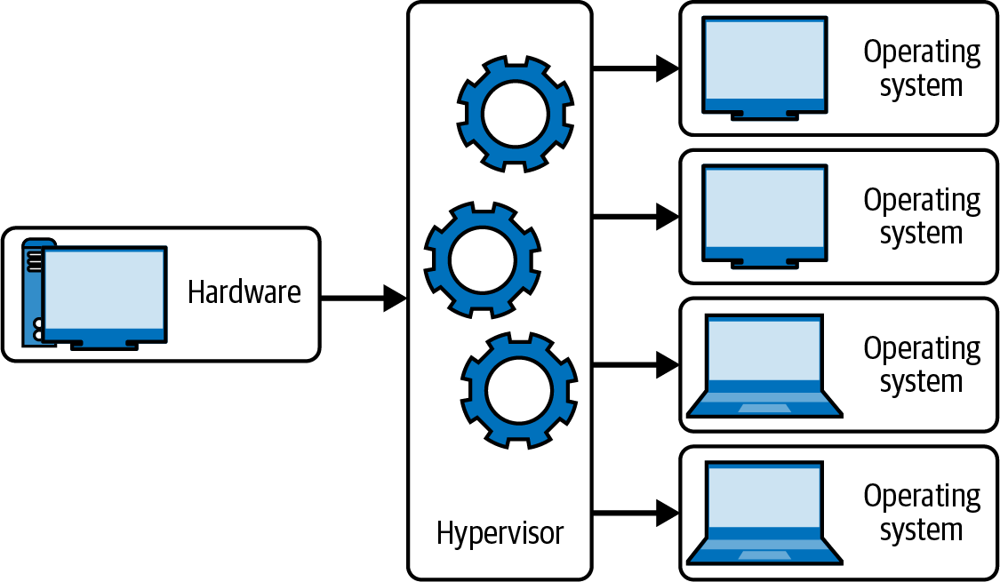

# 💡 Module 1&#x20;

## Fundamentals of Cloud Computing

**What is cloud computing**?

Cloud computing is the delivery of computing services like VM, Storage, Database, Networking etc over the internet.

**Benefits** :-

* Cloud enables software developers, engineers IT professionals to create, build, test and deploy technical solutions productively, effectively and securely
* Cloud engineering offers better speed of development,testing ,maintainability ,automation, scalability and so much more.

## **Cloud Computing vs Virtualization**&#x20;

The main difference between cloud computing and virtualization is, cloud is an environment while virtualization is a technology that enables us to virtualize hardware to create and simulate several machines or dedicated source.

Cloud computing provides on-demand resources for computing, storage, network, platform, webapplications and infrastructure over the internet or cloud. These are pools of virtual services and resources hosted on the cloud, which is accessible by its users anywhere in the world.

## Cloud Hypervisor&#x20;

Hypervisor technology is emerging as a vital tool in virtualizing resources and is driving modern innovation in cloud environments. Hypervisors make resources and applications in the cloud available to their users remotely.

eg:- Microsoft uses a native hypervisor on Azure called Azure Hypervisor

<figure><figcaption>
HyperVisor Technology
</figcaption></figure>

## Types of cloud computing Deployment Model&#x20;

Cloud computing deployment models give us a descriptive overview of cloud computing platforms and their various categories, helping us identify essential facts like who has access to the cloud, how it is hosted, and what is implemented.

Common Types of Cloud deployment models&#x20;

* Public Cloud&#x20;
* Private Cloud&#x20;
* Hybrid Cloud&#x20;
* Community Cloud&#x20;
* Multi Cloud&#x20;

<figure><figcaption>
Cloud Computing Model
</figcaption></figure>

## <mark style="color:blue;">Public Cloud</mark>

A public cloud infrastructure is available to the public or any organization using or selling cloud services. A public cloud platform is a service provided by cloud providers like Azure. The public cloud vendors offer cloud storage and computing resources (operating systems, CPU, memory, storage, web servers, applications, or databases) that are securely shared among its customers with other organizations or tenants of the cloud. The public cloud is offered to its users for a subscription fee or on a pay-as-you-go basis.

<figure><figcaption>
Public Cloud
</figcaption></figure>

Advantages:&#x20;

* On-demand services and portability
* Scalability and reliability
* Flexibility in administration through self-service cloud management portals
* Monitoring, analytics, and report visualization
* Security and privacy
* Disaster recovery and geolocation
* Cost effectiveness and cost management

## <mark style="color:blue;">Private Cloud</mark>

A private cloud infrastructure is operated and owned by one organization: on premises or off premises. An organization utilizing private clouds uses cloud computing technology with considerations for privacy and security. This means that access to the resources in the IT infrastructure within the organization is centralized. Trust boundaries define the organization’s administration of private clouds.

<figure><figcaption>
Private Cloud 
</figcaption></figure>

Advantages:

* Enhanced privacy and security since resources are not shared with others
* Increased control over the infrastructure and owned resources
* Compliance with business-critical security and regulatory compliance requirements
* Flexibility to customize the environments based on the on-demand requirements of the organization or business.

## <mark style="color:blue;">Hybrid Cloud</mark>

A hybrid cloud is a type of cloud infrastructure composed of multiple clouds, a combination of private, public, or community clouds.

<figure><figcaption>
Hybrid Cloud 
</figcaption></figure>

## <mark style="color:blue;">Multi Cloud</mark>

Multi-cloud refers to using multiple cloud computing services from different providers to meet a business’s needs. In other words, rather than relying on a single cloud provider, an organization uses services from multiple providers, such as Amazon Web Services (AWS), Microsoft Azure, Google Cloud Platform (GCP), or IBM Cloud

Advantages:

* Reduced risk of downtime
* Cost Optimization&#x20;
* Improved Security&#x20;
* Flexibility&#x20;
* Better Performance&#x20;
* Avoid Vendor lock in&#x20;
* Increased Resilience
* Agility&#x20;

## Cloud Computing Service Model&#x20;

<figure><figcaption></figcaption></figure>

## <mark style="color:blue;">Shared Responsibility Model</mark>&#x20;

With the shared responsibility model, these responsibilities get shared between the cloud provider and the consumer. Physical security, power, cooling, and network connectivity are the responsibility of the cloud provider. The consumer isn’t collocated with the datacenter, so it wouldn’t make sense for the consumer to have any of those responsibilities.

At the same time, the consumer is responsible for the data and information stored in the cloud. (You wouldn’t want the cloud provider to be able to read your information.) The consumer is also responsible for access security, meaning you only give access to those who need it.

Then, for some things, the responsibility depends on the situation. If you’re using a cloud SQL database, the cloud provider would be responsible for maintaining the actual database. However, you’re still responsible for the data that gets ingested into the database. If you deployed a virtual machine and installed an SQL database on it, you’d be responsible for database patches and updates, as well as maintaining the data and information stored in the database.

## Infrastructure as a Service(IaaC)

Infrastructure as a service (<mark style="color:orange;">IaaS</mark>) is a computing deployment model category in which the public cloud provider like Azure delivers infrastructure through the cloud. Instead of the traditional infrastructure on premises in one physical location, the services are provided by public cloud vendors.

IaaS is a delivery of IT infrastructure resources like web servers, database servers, compute storage, networking, computing data centers, and other compute resources available as a service and on demand. When a cloud computing user uses the IaaS deployment model, they don’t need to worry about maintenance costs or the hassles of having infrastructure on premises in the traditional structure.

## Platform as a Service(PaaS)

It is a cloud model where users, organizations, or developers can create, build, and deploy applications on the cloud without worrying about the IT infrastructure behind it. This means that Microsoft Azure, as one of the PaaS cloud providers, typically provides a range of computing services, development, and monitoring tools for application development on the cloud.\

## Software as a Service(SaaS)

SaaS is a software on-demand cloud model where the cloud service providers give the users access to a fully developed application explicitly created for distribution. The software updates are rolled out for all users, and organizations can use their tools with vendor-provided application programming interfaces (APIs).

eg:- Salesforce, Microsoft 365, Dropbox, OneDrive, Google Workspace

<figure><figcaption>
Shared Responsibility Model 
</figcaption></figure>
